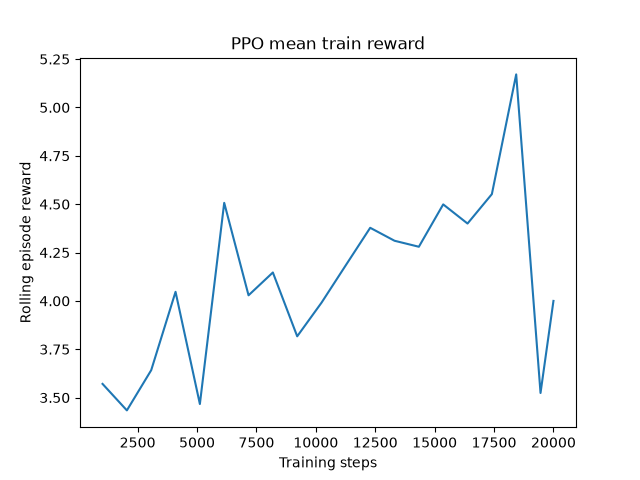

# Insurance Sales RL Agent - Results Report

## Interpretation
PPO mean simulated reward is 4.120; rule baseline is 3.860. Simulated conversion is 5.2% for PPO versus 12.3% for rule. Reward and conversion can favor different policies. These seed runs do not establish real-world effectiveness or statistical superiority.

This is an offline research prototype. No public corpus was used in this run; upstream dataset references and licenses are documented.
Synthetic evidence: 1200 conversations, 20396 turns, 3000 synthetic profiles. Splits: {'train': 812, 'val': 164, 'test': 224}.
Simulated evidence: customer transitions and conversions are generated by the environment, not observed human outcomes.
Experimental evidence: independently trained PPO seed runs, paired held-out scenario seeds, identical products and turn limits.
Tables report seed means +/- sample standard deviation. CSVs include Student-t 95% intervals over seed means; three seeds provide limited statistical power.
Objection resolution is measured over episodes initially containing an objection. Violations count every turn, not only the final turn.

## Table A - Datasets
| Dataset | Size | Source | Purpose | License | Real/Synthetic |
| --- | --- | --- | --- | --- | --- |
| multidogo | metadata only; not used | https://github.com/awslabs/multi-domain-goal-oriented-dialogues-dataset | insurance-domain dialogue structure/intent/slots | CDLA-Permissive (see upstream LICENSE.txt) | external reference |
| casino | metadata only; not used | https://github.com/kushalchawla/CaSiNo | negotiation strategy knowledge | CC-BY-4.0 | external reference |
| deal_or_no_deal | metadata only; not used | https://github.com/facebookresearch/end-to-end-negotiator | strategic offer/accept negotiation | CC-BY-NC (see upstream LICENSE) | external reference |
| goemotions | metadata only; not used | https://github.com/google-research/google-research/tree/master/goemotions | text emotion labels | Apache-2.0 | external reference |
| meld | metadata only; not used | https://github.com/declare-lab/MELD | conversational emotion w/ context | GPL-3.0 repository; check corpus/media terms separately | external reference |
| empathetic_dialogues | metadata only; not used | https://github.com/facebookresearch/EmpatheticDialogues | emotionally sensitive dialogue | CC-BY-NC | external reference |
| banking77 | metadata only; not used | https://github.com/PolyAI-LDN/task-specific-datasets | general intent enrichment | CC-BY-4.0 | external reference |
| insurance_sales_dialogue_dataset v2 | 1200 conversations / 20396 turns | scenario-generator | action/strategy supervision | synthetic-internal | synthetic |
| insurance_customer_profiles | 3000 | profile-generator | customer simulation | synthetic-internal | synthetic |

## Table B - NLP
| Model | accuracy | macro_f1 | weighted_f1 | test_examples | task | dataset |
| --- | --- | --- | --- | --- | --- | --- |
| intent | 1.0 | 1.0 | 1.0 | 1848 | customer_intent | insurance_sales_dialogue_dataset v2 (synthetic) |
| emotion | 0.537 | 0.515 | 0.489 | 1848 | customer_emotion | insurance_sales_dialogue_dataset v2 (synthetic) |
| objection | 1.0 | 1.0 | 1.0 | 1848 | objection_type | insurance_sales_dialogue_dataset v2 (synthetic) |
| stage | 0.37 | 0.306 | 0.351 | 1848 | sales_stage | insurance_sales_dialogue_dataset v2 (synthetic) |

## Table C - RL comparison
| agent | seed_runs | avg_reward | conversion | qualified_lead | objection_resolution | satisfaction | avg_turns | pressure_violations | unsupported | unsuitable_recommendation |
| --- | --- | --- | --- | --- | --- | --- | --- | --- | --- | --- |
| random | 3 | 2.622 +/- 0.210 | 0.003 +/- 0.003 | 0.367 +/- 0.048 | 0.611 +/- 0.010 | 0.620 +/- 0.018 | 7.602 +/- 0.070 | 0.000 +/- 0.000 | 0.000 +/- 0.000 | 0.000 +/- 0.000 |
| rule | 3 | 3.860 +/- 0.511 | 0.123 +/- 0.019 | 0.472 +/- 0.053 | 0.697 +/- 0.043 | 0.647 +/- 0.022 | 11.425 +/- 0.046 | 0.000 +/- 0.000 | 0.000 +/- 0.000 | 0.000 +/- 0.000 |
| supervised | 3 | 3.626 +/- 0.583 | 0.000 +/- 0.000 | 0.417 +/- 0.088 | 0.513 +/- 0.014 | 0.646 +/- 0.030 | 10.692 +/- 0.443 | 0.000 +/- 0.000 | 0.000 +/- 0.000 | 0.000 +/- 0.000 |
| ppo | 3 | 4.120 +/- 0.683 | 0.052 +/- 0.028 | 0.483 +/- 0.072 | 0.782 +/- 0.055 | 0.669 +/- 0.032 | 11.803 +/- 0.030 | 0.000 +/- 0.000 | 0.000 +/- 0.000 | 0.000 +/- 0.000 |

## Table D - Ablations
| config | seed_runs | avg_reward | conversion | qualified_lead | objection_resolution | satisfaction | avg_turns | pressure_violations | unsupported | unsuitable_recommendation |
| --- | --- | --- | --- | --- | --- | --- | --- | --- | --- | --- |
| full_ppo | 3 | 4.393 +/- 1.035 | 0.053 +/- 0.031 | 0.513 +/- 0.130 | 0.737 +/- 0.055 | 0.688 +/- 0.049 | 11.773 +/- 0.112 | 0.000 +/- 0.000 | 0.000 +/- 0.000 | 0.000 +/- 0.000 |
| no_emotion | 3 | 4.121 +/- 0.879 | 0.000 +/- 0.000 | 0.530 +/- 0.145 | 0.896 +/- 0.020 | 0.702 +/- 0.053 | 11.983 +/- 0.185 | 0.000 +/- 0.000 | 0.000 +/- 0.000 | 0.000 +/- 0.000 |
| no_objection | 3 | 4.188 +/- 0.831 | 0.023 +/- 0.015 | 0.493 +/- 0.110 | 0.550 +/- 0.059 | 0.685 +/- 0.045 | 11.880 +/- 0.130 | 0.000 +/- 0.000 | 0.000 +/- 0.000 | 0.000 +/- 0.000 |
| no_yes_yes | 3 | 4.310 +/- 1.057 | 0.023 +/- 0.025 | 0.527 +/- 0.146 | 0.740 +/- 0.088 | 0.694 +/- 0.052 | 11.873 +/- 0.207 | 0.000 +/- 0.000 | 0.000 +/- 0.000 | 0.000 +/- 0.000 |
| reduced_actions | 3 | 4.413 +/- 0.932 | 0.043 +/- 0.040 | 0.510 +/- 0.105 | 0.717 +/- 0.018 | 0.683 +/- 0.049 | 11.797 +/- 0.194 | 0.000 +/- 0.000 | 0.000 +/- 0.000 | 0.000 +/- 0.000 |
| conversion_only_reward | 3 | 4.369 +/- 0.877 | 0.090 +/- 0.010 | 0.513 +/- 0.101 | 0.820 +/- 0.072 | 0.680 +/- 0.041 | 11.610 +/- 0.090 | 0.000 +/- 0.000 | 0.000 +/- 0.000 | 0.000 +/- 0.000 |
| no_supervised_init | 3 | 3.954 +/- 2.797 | 0.090 +/- 0.156 | 0.617 +/- 0.092 | 0.950 +/- 0.044 | 0.730 +/- 0.031 | 11.577 +/- 0.711 | 0.000 +/- 0.000 | 0.000 +/- 0.000 | 0.000 +/- 0.000 |

Ablations are retrained with identical step budgets. Removed features are disabled during training and evaluation. Reward ablations use a shared evaluation reward.
The simulator reacts to actions and eligibility; it does not semantically evaluate wording. LLM wording comparisons measure generator failures, not human preference.

## Skipped Experiments
| experiment | reason |
| --- | --- |
| direct_llm | INSURANCE_LLM_MODEL is not configured |
PPO + Ollama wording ablation is skipped when INSURANCE_LLM_MODEL is unset.

## Reward Curves

Each experiments/*/run.json records rolling training reward and value loss across rollout updates.
Optional matplotlib produces corresponding *_reward_curve.png plots. These curves measure training reward, not held-out performance.

## Representative Conversations
### Seed 42, episode 0, turn 0
Strategy: NEED_DISCOVERY. Reward: 0.5.
Agent: Who would the cover be for, and what would you like it to protect?
Synthetic customer: I need critical illness with a low budget.

### Seed 42, episode 0, turn 1
Strategy: CLARIFYING_QUESTION. Reward: 0.3.
Agent: What budget and coverage needs should we consider?
Synthetic customer: I need critical illness with a low budget.

### Seed 42, episode 0, turn 2
Strategy: CLARIFYING_QUESTION. Reward: -1.3.
Agent: What budget and coverage needs should we consider?
Synthetic customer: I need critical illness with a low budget.

### Seed 42, episode 0, turn 3
Strategy: CLARIFYING_QUESTION. Reward: 0.0.
Agent: What budget and coverage needs should we consider?
Synthetic customer: I need critical illness with a low budget.

### Seed 42, episode 0, turn 4
Strategy: CLARIFYING_QUESTION. Reward: -1.3.
Agent: What budget and coverage needs should we consider?
Synthetic customer: I need critical illness with a low budget.

### Seed 42, episode 0, turn 5
Strategy: CLARIFYING_QUESTION. Reward: -1.3.
Agent: What budget and coverage needs should we consider?
Synthetic customer: I need critical illness with a low budget.

### Seed 42, episode 0, turn 6
Strategy: CLARIFYING_QUESTION. Reward: 0.0.
Agent: What budget and coverage needs should we consider?
Synthetic customer: I need critical illness with a low budget.

### Seed 42, episode 0, turn 7
Strategy: CLARIFYING_QUESTION. Reward: 0.0.
Agent: What budget and coverage needs should we consider?
Synthetic customer: I need critical illness with a low budget.

## Limitations
- Synthetic templates have repeated wording; scenario grouping reduces leakage but cannot establish human generalization.
- Emotion/stage labels are generated heuristically and are not validated human annotations.
- Linear NumPy PPO is a portable reference backend; production use should benchmark a maintained RL library.
- Synthetic product premium bands are not insurer quotations; some needs have no matching products.
- Response validation checks numeric claims, certain guarantees, and repetition; it is not a complete semantic factuality proof.
- External NLP transfer and real LLM results need downloaded corpora and a configured local model. Speech is deferred.

## Method Sources
- PPO: https://arxiv.org/abs/1707.06347
- Gymnasium: https://gymnasium.farama.org/api/env/
- Ollama: https://docs.ollama.com/api/chat